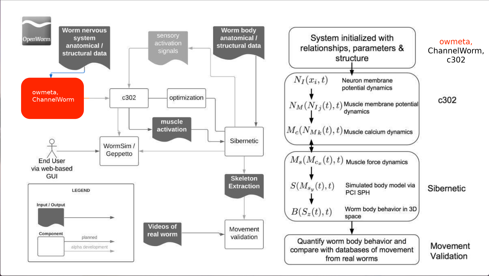

[](https://github.com/openworm/owmeta/actions/workflows/dev-test.yml)
[](https://owmeta.readthedocs.io/en/latest)
[](https://coveralls.io/github/openworm/owmeta?branch=dev)

owmeta
======


A data access layer in Python which integrates disparate structures and
representations for *C. elegans* anatomy and physiology. Enables a simple
Python API for asking various questions about the cells of the *C. elegans* and
enabling data sharing for the purpose of building a [data-to-model
pipeline](http://docs.openworm.org/en/latest/projects) for the
[OpenWorm](http://www.openworm.org) project.

Overview
--------


The data and models required to simulate *C. elegans* are highly heterogeneous.
Consequently, from a software perspective, a variety of underlying
representations are needed to store different aspects of the relevant anatomy
and physiology.  For example, a NetworkX representation of the connectome as a
complex graph enables questions to be asked about nearest neighbors of a given
neuron.  An RDF semantic graph representation is useful for reading and writing
annotations about multiple aspects of a neuron, such as what papers have been
written about it, properties it may have such as ion channels and
neurotransmitter receptors, etc.  A NeuroML representation is useful for
answering questions about model morphology and simulation parameters.  A
Blender representation is a full 3D shape definition that can be used for
calculations in 3D space.

The diversity of underlying representations required for OpenWorm presents a
challenge for data integration and consolidation.  owmeta solves this
challenge with a unified data access layer whereby different representations
are encapsulated into an abstract view.  This allows the user to work with
objects related to the *biological reality of the worm*, and forget about which
representation is being used under the hood.  The worm itself has a unified
sense of neurons, networks, muscles, ion channels, etc. and so should our code.

Relationship to ChannelWorm2
-----------------------------
[ChannelWorm2](https://github.com/openworm/ChannelWorm2) is the sub-project of
OpenWorm which houses ion channel models. In the future, we expect
ChannelWorm2 to be a "consumer" of owmeta. An owmeta database will house
physical models, the digitized plots they are derived from (there is a Plot
type in owmeta), and provide code to put those models into enumerated formats
along with auxiliary files or comments. However, because these projects were
not developed sequentially, there is currently some overlap in functionality,
and owmeta itself houses a fairly substantial amount of physiological
information about *C. elegans.* Ultimately, the pure core of owmeta, which is
meant to be a data framework for storing metadata and provenance (i.e.
parameters and trajectories associated with simulations), will be separated out
into standalone functionality.

Versioning data as code
-----------------------

A library that attempts to reliably expose dynamic data can often be broken
because the underlying data sets that define it change over time.  This is
because data changes can cause queries to return different answers than before,
causing unpredictable behavior.

As such, to create a stable foundational library for others to reuse, the
version of the owmeta library guarantees the user a specific version of the
data behind that library.  In addition, unit tests are used to ensure basic
sanity checks on data are maintained.  As data are improved, the maintainers of
the library can perform appropriate regression tests prior to each new release
to guarantee stability.

Installation
------------

See INSTALL.md

Quickstart
-----------

To get started, you'll need to connect to a database. The OpenWorm owmeta
"project" is currently hosted at `https://github.com/openworm/OpenWormData.git`.
This project holds a working-copy of the database. You can retrieve it by
executing the following command line after owmeta installation:

```bash
owm clone https://github.com/openworm/OpenWormData.git --branch owmeta
```

This command should create a directory `.owm` in your current working
directory. Then, in Python, from the same working directory:
```python
>>> from owmeta_core.command import OWM
>>> conn = OWM().connect()

```

This creates a connection to the project stored under the `.owm` directory.

Then you can try out a few things:

```python
# Make the context
>>> from owmeta_core.context import Context
>>> ctx = conn(Context)(ident='http://openworm.org/data')

# Grab the representation of the neuronal network
>>> from owmeta.worm import Worm
>>> net = ctx.stored(Worm).query().neuron_network()

# Grab a specific neuron
>>> from owmeta.neuron import Neuron
>>> aval = ctx.stored(Neuron).query(name='AVAL')

# Get the neuron's type
>>> aval.type.one()
'interneuron'

# Count how many connections come from AVAL
>>> aval.connection.count('pre')
86

```

More examples
-------------

Return information about individual neurons:

```python
>>> aval.name()
'AVAL'

# List all known receptors
>>> sorted(aval.receptors())
['GGR-3', 'GLR-1', ... 'NPR-4', 'UNC-8']

# Show how many chemical synapses go in and out of AVAL
>>> aval.connection.count('either', syntype='send')
105

```

Return the list of all neurons:

```python
>>> len(set(net.neuron_names()))
302
>>> sorted(net.neuron_names())
['ADAL', 'ADAR', ... 'VD8', 'VD9']

```

Return a set of all muscles:

```python
>>> muscles = ctx.stored(Worm).query().muscles()
>>> len(muscles)
158

```
Because the ultimate aim of OpenWorm is to be a platform for biological
research, the physiological data in owmeta should be uncontroversial and
well supported by evidence. Using the Evidence type, it is possible to link
data and models to corresponding articles from peer-reviewed literature:

```python
>>> from owmeta.document import Document
>>> from owmeta.evidence import Evidence

# Make a context for evidence (i.e., statements about other groups of statements)
>>> evctx = conn(Context)(ident='http://example.org/evidence/context')

# Make a context for defining domain knowledge
>>> dctx = conn(Context)(ident='http://example.org/data/context')
>>> doc = evctx(Document)(key="Sulston83", author='Sulston et al.', date='1983')
>>> e = evctx(Evidence)(key="Sulston83", reference=doc)
>>> avdl = dctx(Neuron)(name="AVDL")
>>> avdl.lineageName("AB alaaapalr")
owmeta_core.statement.Statement(subj=Neuron(ident=rdflib.term.URIRef('http://data.openworm.org/sci/bio/Neuron#AVDL')), prop=owmeta.cell.Cell_lineageName(owner=Neuron(ident=rdflib.term.URIRef('http://data.openworm.org/sci/bio/Neuron#AVDL'))), obj=owmeta_core.dataobject_property.ContextualizedPropertyValue(rdflib.term.Literal('AB alaaapalr')), context=owmeta_core.context.Context(ident="http://example.org/data/context"))
>>> e.supports(dctx.rdf_object)
owmeta_core.statement.Statement(subj=Evidence(ident=rdflib.term.URIRef('http://data.openworm.org/Evidence#Sulston83')), prop=owmeta.evidence.Evidence_supports(owner=Evidence(ident=rdflib.term.URIRef('http://data.openworm.org/Evidence#Sulston83'))), obj=ContextDataObject(ident=rdflib.term.URIRef('http://example.org/data/context')), context=owmeta_core.context.Context(ident="http://example.org/evidence/context"))
>>> with conn.transaction_manager:
...     dctx.save_context()
...     evctx.save_context()

```

Retrieve evidence:
```python
>>> doc = evctx.stored(Document)(author='Sulston et al.', date='1983')
>>> e0 = evctx.stored(Evidence)(reference=doc)
>>> supported_ctx = e0.supports()

# is the neuron's presence asserted?
>>> dctx.identifier == supported_ctx.identifier
True

```

Query for neurons in *C. elegans*:
```python
>>> from owmeta.network import Network

# The default Worm() is for C. elegans
>>> with ctx.stored(Worm, Neuron, Network) as cctx:
...     w = cctx.Worm()
...     net = cctx.Network()
...     w.neuron_network(net)
owmeta_core.statement.Statement(subj=Worm(ident=rdflib.term.URIRef('http://data.openworm.org/sci/bio/Worm#a8020ed8519038a6bbc98f1792c46c97b')), prop=owmeta.worm.Worm_neuron_network(owner=Worm(ident=rdflib.term.URIRef('http://data.openworm.org/sci/bio/Worm#a8020ed8519038a6bbc98f1792c46c97b'))), obj=Network(ident=rdflib.term.URIRef('http://data.openworm.org/sci/bio/Network#a5859bb1e51537f60e506c283401fcd84')), context=owmeta_core.context.QueryContext(ident="http://openworm.org/data"))

...     neur = cctx.Neuron.query()
...     net.neuron(neur)
...     neur.count()
302

```

See what neurons express a given neuropeptide:
```python
>>> n = ctx.stored(Neuron).query()
>>> n.neuropeptide("INS-26")
owmeta_core.statement.Statement(subj=Neuron(ident=rdflib.term.Variable('aNeuron_...')), prop=owmeta.neuron.Neuron_neuropeptide(owner=Neuron(ident=rdflib.term.Variable('aNeuron_...'))), obj=owmeta_core.dataobject_property.ContextualizedPropertyValue(rdflib.term.Literal('INS-26')), context=owmeta_core.context.QueryContext(ident="http://openworm.org/data"))

>>> sorted(x.name() for x in n.load())
['ASEL', 'ASER', 'ASIL', 'ASIR']

```

Get direct access to the RDFLib graph:
```python
>>> conn.rdf.query("SELECT ?y WHERE { ?x rdf:type ?y }")
<rdflib.plugins.sparql.processor.SPARQLResult object at ...>

```

Modeling data
-------------

As described above, ultimately, ion channel models will be part of the
ChannelWorm2 repository. As the project evolves, other models, such as for
reproduction and development, may be housed in their own repositories. But for
the time being, the owmeta repository contains specific models as well. These
models will eventually be transferred to an appropriate and independent data
repository within the OpenWorm suite of tools.


```python
# Get data for a subtype of voltage-gated potassium channels
>>> from owmeta.channel import Channel
>>> kv1 = ctx(Channel)(subfamily='Kv1.1')
>>> kv1.models()

```

The same type of operation can be used to obtain the experimental data a given
model was derived from.

```python
# Get experiment(s) that back up the data model
>> some_model = mods[0]
>> some_model.references.get()

```

Finally, when you're done accessing the database, be sure to disconnect from it:
```python
>>> conn.disconnect()

```

More examples can be found [in the owmeta-core
documentation](https://owmeta-core.readthedocs.io/en/latest/making_dataObjects.html)
and [in the ./examples directory of the owmeta Git
repository](https://github.com/openworm/owmeta/tree/master/examples).

Documentation
-------------

Further documentation [is available online](http://owmeta.readthedocs.io).

Contributing
------------
We happily welcome pull requests and [bug
reports](https://github.com/openworm/owmeta/issues/new). If, you are not
sure how you can contribute, fill out this (short)
[form](https://docs.google.com/forms/d/e/1FAIpQLSdzVilyRX3z9e0PeAoQdXhBDiNXp2ugqpnT536xA2iQbLNymQ/viewform?formkey=dC1CUDQtTV82MEJJcjY0NjdCcHpYdmc6MQ#gid=0),
and you'll receive an invite to our Slack chat where you can initiate more
in-depth conversations.


Questions/Concerns?
-------------------
You can ask questions, leave bug reports, or propose features on [our issue
tracker](https://github.com/openworm/owmeta/issues/new).

